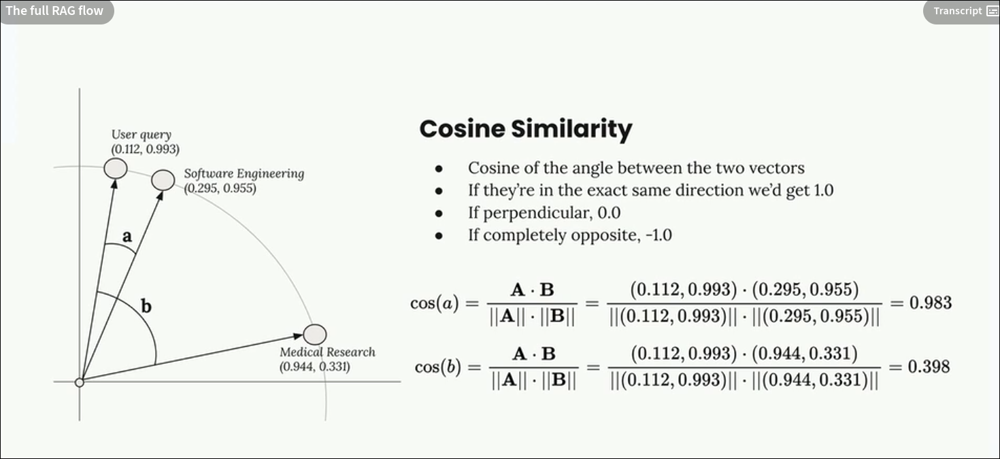

## The Complete RAG Flow

### The Big Picture (What RAG Really Does)

```
[Your Documents] → [Chunks] → [Embeddings] → [Vector DB]
                                                  ↓
[User Question] → [Embedding] → [Semantic Search] → [Best Matches] → [Context] → [LLM] → [Answer]
```

---

## The 7 Steps of RAG (With Memory Tricks!)

### **STEP 1: Chunk Your Documents** 📄 → ✂️

```python
# What happens:
Source Document → Split into smaller pieces

# Example:
"Long medical paper..." → ["Medical research section", "Software engineering section"]

# REMEMBER: Like cutting a pizza into slices - each slice is manageable!
```

### **STEP 2: Create Embeddings** 🔢

```python
# What happens:
Each chunk → Convert to numbers (vector)

# Example (simplified - real embeddings have 384-1536 dimensions!):
"Medical research" → [0.97, 0.34, 0.12, -0.45, ...]
"Software engineering" → [0.30, 0.97, 0.89, 0.23, ...]

# REMEMBER: Each chunk becomes a unique "fingerprint" of numbers
```

### **STEP 3: Normalize** 📏

```python
# What happens:
Adjust vectors so they all have length = 1

# Why? So we can compare fairly (like scaling test scores to be out of 100)
```

### **STEP 4: Store in Vector Database** 💾

```python
# What happens:
Save (embedding + original text) together

vector_db.add(
    embedding=[0.97, 0.34, ...],
    metadata={"text": "Medical research section..."}
)

# REMEMBER: Always store the text with the vector!
```

### **STEP 5: PAUSE (Wait for User)** ⏸️

```python
# All preprocessing done! Now we wait...
# REMEMBER: Steps 1-4 happen ONCE, ahead of time
```

### **STEP 6: User Asks Question** ❓

```python
user_question = "What did software engineering do this year?"

# Convert question to embedding (same process!)
question_embedding = [0.89, 0.10, 0.92, 0.31, ...]

# REMEMBER: Questions become numbers too!
```

### **STEP 7: Semantic Search - Find Matches** 🔍

```python
# THIS IS THE KEY STEP! Three ways to search:

# 1️⃣ SEMANTIC SEARCH (What RAG uses) ✅
"""
Compares MEANING using vector math

Question embedding → Compare with ALL chunk embeddings
Find chunks with closest vectors

Question: "engineering team achievements"
Finds: "shipped 127 features", "launched AI engine", "fixed 892 bugs"
EVEN IF different words are used!
"""

# 2️⃣ LEXICAL SEARCH (Traditional - NOT what RAG uses) ❌
"""
Matches exact words only

Question: "engineering team achievements"
Finds: ONLY chunks containing "engineering", "team", or "achievements"
Misses: "shipped features", "launched products"
"""

# 3️⃣ HYBRID SEARCH (Combines both)
"""
Uses semantic + lexical together
Better but more complex
"""
```

---

## The Search Math



### **Cosine Similarity** = How close two vectors are:

```
Perfect match:    ●───●  = 1.0
Close match:      ●──●    = 0.8
Somewhat related: ●─●     = 0.5
Not related:      ●    ●  = 0.2
Opposite:         ●────●  = -1.0
```

---

## Semantic vs Lexical - Why RAG Uses Semantic

| Aspect      | Lexical Search          | Semantic Search (RAG)                      |
| ----------- | ----------------------- | ------------------------------------------ |
| **Matches** | Exact words only        | Meaning & concepts                         |
| **Example** | "car" finds only "car"  | "car" finds "car", "automobile", "vehicle" |
| **Misses**  | Synonyms, related terms | Rarely misses related content              |
| **Speed**   | Very fast               | Fast                                       |
| **Quality** | Low                     | High                                       |

**Example in action:**

```
Query: "engineering achievements"

Lexical search finds:
❌ "engineering" - maybe not there
❌ "achievements" - maybe not there
Result: NOTHING!

Semantic search finds:
✅ "shipped 127 features"
✅ "launched AI engine"
✅ "fixed 892 bugs"
Result: PERFECT MATCHES!
```

---

## What to Remember (Cheat Sheet) 📝

```python
# THE COMPLETE RAG FLOW

# PRE-PROCESSING (Do once)
chunks = split_document(text)                    # 1. Chunk
embeddings = embed(chunks)                       # 2. Embed
vector_db.store(embeddings, chunks)              # 3. Store

# AT QUERY TIME (Do for each question)
question_emb = embed(user_question)               # 4. Embed question
matches = vector_db.semantic_search(question_emb) # 5. Semantic search
context = [match.text for match in matches]       # 6. Get relevant text
prompt = f"Context: {context}\nQuestion: {user_question}"
answer = llm.complete(prompt)                     # 7. Generate answer
```

---

## Key Takeaways 🎯

1. **Semantic search** = finding meaning, not just words
2. **Cosine similarity** = how close two meanings are (0 to 1)
3. **Higher similarity** = more relevant (0.8+ is great!)
4. **Always store text with vectors** - numbers alone are useless
5. **RAG is just**: Find relevant chunks → Give to LLM → Get answer

---

## The 30-Second Summary ⏱️

```
Documents → Chunks → Numbers → Vector DB
                        ↓
Question → Numbers → SEMANTIC SEARCH → Best Matches → LLM → Answer!

REMEMBER: Semantic search finds MEANING, not just words!
```
