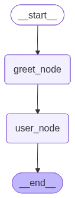

# The Simplest Graph

Let's build a simple graph with 3 nodes and one conditional edge.


## State

First, define the [State](https://docs.langchain.com/oss/python/langgraph/graph-api#state) of the graph.

The State schema serves as the input schema for all Nodes and Edges in the graph.

Let's use the `TypedDict` class from python's `typing` module as our schema, which provides type hints for the keys.

## Nodes & Edges

LangGraph organizes workflows using nodes and edges.

### Nodes

- Individual pieces of information or actions
- Examples:
  - Question
  - Method
  - Action
  - Agent/tool

Each node represents a specific task or data unit.

---

### Edges

- Connections between nodes
- Define relationships
- Control execution flow

One node may depend on output of another.

---

## Hello World! (LangGraph)

Basic example to understand nodes and edges.

```py
# Install LangGraph library
!pip install langgraph

# Import TypedDict to create a structured dictionary blueprint for our workflow state
from typing_extensions import TypedDict

# Import StateGraph (the modern workflow builder), START (entry point marker), and END (exit point marker)
from langgraph.graph import StateGraph, START, END


# Define the State structure: a TypedDict that requires a "message" key with string value
# This acts as the data format that flows between all nodes in the workflow
class State(TypedDict):
    message: str


# Node 1: greet function
# Receives the current state dictionary, returns an update to the message field
def greet(state: State):
    # Return a dictionary that updates the "message" field to "Hello "
    # LangGraph merges this with the existing state
    return {"message": "Hello "}


# Node 2: user function
# Receives the state (now containing "Hello " from greet node), appends "Anil!" to it
def user(state: State):
    # Read current message from state, append "Anil!", return the update
    return {"message": state["message"] + "Anil!"}


# Create the workflow builder, passing our State structure as the schema
workflow = StateGraph(State)

# Register the greet function as a node named "greet_node"
workflow.add_node("greet_node", greet)

# Register the user function as a node named "user_node"
workflow.add_node("user_node", user)

# Connect START (workflow beginning) to greet_node — execution starts here
workflow.add_edge(START, "greet_node")

# Connect greet_node to user_node — after greet finishes, user runs next
workflow.add_edge("greet_node", "user_node")

# Connect user_node to END — after user finishes, workflow terminates
workflow.add_edge("user_node", END)

# Compile the workflow blueprint into an executable graph
app = workflow.compile()

# Create the initial state with a "message" field (required by our State structure)
input_state = {"message": "Hi"}

# Execute the compiled graph with streaming to see intermediate outputs
# stream() yields output after each node execution
for output in app.stream(input_state):
    # Each output is a dictionary with one item: {node_name: state_update}
    for key, value in output.items():
        # key = node name that just executed (e.g., "greet_node")
        # value = the state update dictionary returned by that node
        print(f"Output from node '{key}':")
        print("---")
        print(value)
    print("\n---\n")

# ---------OR------------
app.invoke()

# view
display(Image(app.get_graph().draw_mermaid_png()))
```

---

## Output

```id="b5yb01"
Output from node 'greet_node':
{'message': 'Hello '}

-----

Output from node 'user_node':
{'message': 'Hello  Miku!'}

-----
```



---

## Line-by-Line Explanation

```python
from langgraph.graph import StateGraph, START, END
```

**What it does:** Imports three things from LangGraph:

- `StateGraph` — The main builder class for creating workflows (replaced the old `Graph`)
- `START` — A special marker constant indicating where the workflow begins
- `END` — A special marker constant indicating where the workflow finishes

**Why `StateGraph` instead of `Graph`:** The old `Graph` was too simple. `StateGraph` forces you to define your data structure upfront, which makes complex workflows more predictable and debuggable.

---

```python
class State(TypedDict):
    message: str
```

**What it does:** Creates a blueprint called `State`. It says: _"Any state dictionary in this workflow must have a key called `'message'`, and its value must be a string."_

**Real-world analogy:** Like defining a form where one field is "message" and it must contain text.

**Important:** This doesn't create data — it only defines the **structure**. The actual data is created later when you call `app.stream()`.

---

```python
def greet(state: State):
```

**What it does:** Defines the first node function. It takes one parameter named `state`, which must match the `State` structure we defined.

**What `state` contains:** A dictionary like `{"message": "some string"}`. When the workflow starts, it receives whatever initial state you provide.

---

```python
    return {"message": "Hello "}
```

**What it does:** Returns a **partial update** to the state. It says: _"Update the `message` field to be 'Hello '."_

**Critical concept:** You don't return the full state — you return only what you want to **change**. LangGraph automatically merges this with the existing state.

**Behind the scenes:** If previous state was `{"message": "Hi"}`, this return value changes it to `{"message": "Hello "}`.

---

```python
def user(state: State):
```

**What it does:** Defines the second node. It also receives the current `state` (which now contains the updated message from the `greet` node).

---

```python
    return {"message": state["message"] + "Anil!"}
```

**What it does:** Reads the current `message` from state, appends `"Anil!"` to it, and returns the update.

**Step-by-step:**

- `state["message"]` retrieves `"Hello "` (from the previous node)
- `"Hello " + "Anil!"` produces `"Hello Anil!"`
- Returns `{"message": "Hello Anil!"}` to update the state

---

```python
workflow = StateGraph(State)
```

**What it does:** Creates the workflow builder. You pass your `State` blueprint so LangGraph knows what data structure to expect throughout the entire workflow.

**Analogy:** Like starting a new document with a specific template.

---

```python
workflow.add_node("greet_node", greet)
```

**What it does:** Registers your `greet` function as a node named `"greet_node"`. The string name is how you'll reference it when connecting nodes.

**First argument:** The node's name (string identifier)
**Second argument:** The actual function to run

---

```python
workflow.add_node("user_node", user)
```

**What it does:** Registers the `user` function as `"user_node"`.

---

```python
workflow.add_edge(START, "greet_node")
```

**What it does:** Creates a connection from `START` (the workflow's beginning) to `"greet_node"`.

**When executed:** The workflow starts here and immediately runs the `greet` function.

---

```python
workflow.add_edge("greet_node", "user_node")
```

**What it does:** Connects the output of `"greet_node"` to `"user_node"`. After `greet` finishes, `user` runs next.

---

```python
workflow.add_edge("user_node", END)
```

**What it does:** Connects `"user_node"` to `END`. After `user` finishes, the workflow terminates.

---

```python
app = workflow.compile()
```

**What it does:** Converts your workflow blueprint into an executable graph. This step validates all connections and prepares the graph for running.

**Why needed:** The builder pattern separates "design time" (defining nodes/edges) from "runtime" (actually executing). Compilation catches errors before execution.

---

```python
input_state = {"message": "Hi"}
```

**What it does:** Creates the **initial state** dictionary. It must match your `State` structure — here, it has the required `"message"` key.

**Note:** The value `"Hi"` gets immediately overwritten by the `greet` node, but you must provide something valid to start.

---

```python
for output in app.stream(input_state):
```

**What it does:** Runs the compiled graph with your initial state. `stream()` runs the workflow step-by-step and yields (returns one at a time) the output of each node.

**Why stream:** Lets you see intermediate results between nodes, not just the final output.

---

```python
    for key, value in output.items():
```

**What it does:** Each `output` from `stream()` is a dictionary where:

- `key` = the node name that just executed (e.g., `"greet_node"`)
- `value` = the state update returned by that node (e.g., `{"message": "Hello "}`)

---

```python
        print(f"Output from node '{key}':")
        print("---")
        print(value)
    print("\n---\n")
```

**What it does:** Pretty-prints which node ran and what it produced, with separators for readability.b

---

## Will This Syntax Be Used for All Future Agents?

**Yes, absolutely.** This `StateGraph` pattern is LangGraph's **core architecture** and will be used for:

| Agent/Workflow Type                   | How It Uses This Pattern                                               |
| ------------------------------------- | ---------------------------------------------------------------------- |
| **Simple chains** (like your example) | Basic `StateGraph` with sequential nodes                               |
| **Conditional routing**               | Add `add_conditional_edges()` to branch based on state                 |
| **Multi-agent systems**               | Each agent is a node; state passes messages between them               |
| **Tool-calling agents**               | Nodes = agent logic + tool execution; state tracks tool inputs/outputs |
| **Human-in-the-loop**                 | Special nodes that pause for human input, stored in state              |
| **RAG pipelines**                     | Nodes for retrieval, generation, citation checking                     |
| **Reflection agents**                 | Loops where output feeds back as input for self-improvement            |

## Universal Concepts You'll Always Use:

1. **`State` (TypedDict)** — Every workflow needs defined state structure
2. **`StateGraph`** — The builder for all workflows
3. **Nodes as functions** — Always `def node_name(state: State):`
4. **State updates as return values** — Always return dictionaries
5. **`add_edge()` / `add_conditional_edges()`** — Control flow between nodes
6. **`START` / `END`** — Entry and exit points
7. **`.compile()`** — Required before execution
8. **`.stream()` or `.invoke()`** — Execution methods

> ###### The only variations are **what data you put in state** and **how you connect nodes** — the fundamental pattern never changes.
