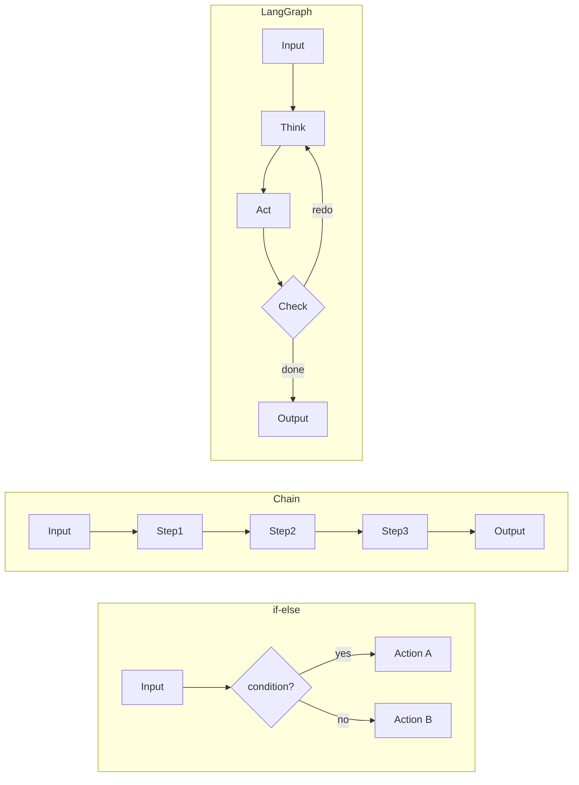

# Module 1: Introduction

## why LangGraph vs if-else, vs chains

- Imagine you're giving directions to a robot. With "if-else", you write every possible path ahead of time. With "chains", the robot follows a fixed recipe. But what if the robot needs to change its mind mid-way? Or try something, fail, and try again? That's what LangGraph does.

- So, Technically Traditional code (if-else) is deterministic and brittle for multi-step LLM workflows. Chains are linear DAGs (Directed Acyclic Graphs) with no cycles or conditional loops. LangGraph enables **cyclic, stateful, conditional** execution — essential for agents that plan, act, observe, and adapt.

### Key Terms

| Term              | Simple Definition                           |
| ----------------- | ------------------------------------------- |
| **Deterministic** | Same input always gives same output         |
| **Brittle**       | Breaks easily when unexpected things happen |
| **Cyclic**        | Can loop back to previous steps             |
| **Stateful**      | Remembers what happened earlier             |

### Visual: Three Approaches Compared



### Problem It Solves

**Real scenario:** Building a customer support agent.

- **if-else:** You'd need 10,000+ conditions to handle every possible question
- **Chain:** Works for "reset password" flow, but fails if user asks something else mid-flow
- **LangGraph:** Agent can decide: "I need more info" → ask question → get answer → continue → verify → retry if wrong

### When NOT to Use LangGraph

- Single LLM call (just use `invoke()`)
- Fixed, simple workflows (3-5 deterministic steps)
- No need for memory or loops
- You're building a simple API wrapper

### Failure Case

**Infinite loop:** Graph with no termination condition

```
Node A → Node B → Node A → Node B → (never ends)
```

The agent keeps repeating without ever reaching an "END" node.

### Step-by-Step Flow of a Simple Agent

```
1. User: "Book a flight to Paris"
2. Agent thinks: "Need departure city"
3. Agent acts: Asks user "Where are you flying from?"
4. Checks: "Got all info? No"
5. Loops back: Get response, add to memory
6. Agent thinks: "Have departure and destination"
7. Agent acts: Calls flight API
8. Checks: "Done? Yes" → Terminate
```
