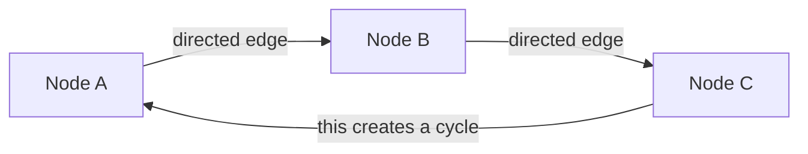

# 1.1 What is a graph? (nodes, edges, directed/cyclic graphs)

## Simple Definition

A **graph** is a collection of **dots** (called **nodes**) connected by **lines** (called **edges**). That's it.

## Analogy: City Map

| Graph Term    | Real World                        | What it means                           |
| ------------- | --------------------------------- | --------------------------------------- |
| Node          | Intersection (circle on map)      | A "place" where something happens       |
| Edge          | Road connecting two intersections | A path to move from one node to another |
| Directed edge | One-way street                    | You can only go in one direction        |
| Cyclic graph  | Roundabout or loop                | You can come back to where you started  |

## Key Terms Defined Simply

- **Node** (also called "vertex"): A single point/step/action. Draw it as a circle ⚪.
- **Edge**: A connection between two nodes. Draw it as an arrow (→) or line (—).
- **Directed graph**: Every edge has an arrow → showing direction. You can only travel that way.
- **Undirected graph**: Edges have no arrows. You can travel both ways (like a two-way street).
- **Cyclic graph**: There exists at least one path that starts and ends at the same node (a loop).
- **Acyclic graph**: No loops possible. You can never return to a node you left.

## Simple Visual (Mermaid)

Above: A → B → C → A is a **cycle** (cyclic graph).

## Real-World Job Relevance

As a GenAI backend developer, you will use **directed cyclic graphs** to build AI agents that:

- Loop back to fix their own mistakes
- Try multiple paths and pick the best answer
- Repeat steps until a condition is met (e.g., "keep searching until you find the answer")

Without graphs, you write linear code that cannot loop intelligently. With graphs, you design flexible AI workflows.

---
