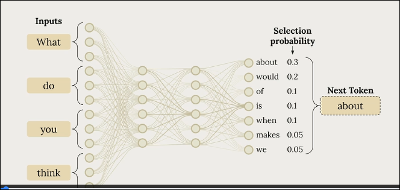
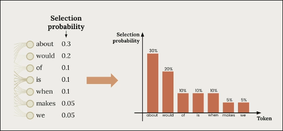

# How AI models Generate Text

- **Process**: Input text → Tokenization → Prediction phase → Sampling phase

- **Example**: Input "What do you think" → Possible next tokens with probabilities:

  - about (0.3 / 30%)
  - would (0.2 / 20%)
  - of (0.1 / 10%)
  - is (0.1 / 10%)
  - when (0.1 / 10%)
  - makes (0.05 / 5%)
  - we (0.05 / 5%)

- **Selection**: Based on probabilities, "about" might be chosen → "What do you think about"

## What is Temperature?

- A parameter between 0.0 and 1.0 that controls randomness in text generation
- Influences the probability distribution of token selection

## How Temperature Affects Selection

#### Low Temperature (0.0 - 0.3)

- **Effect**: Highest probability token becomes more likely (up to 100% at temp=0)
- **Result**: Deterministic output - always selects token with highest initial probability
- **At temp=0**: Always choose the most probable token

#### Increasing Temperature

- Increases chances of selecting tokens with lower initial probabilities
- **Example**: Token "we" might go from 0% chance to 9% chance

## Temperature Ranges and Use Cases

| Temperature Range    | Characteristics                      | Best For                                                                                             |
| -------------------- | ------------------------------------ | ---------------------------------------------------------------------------------------------------- |
| **Low (0.0-0.3)**    | Factual, predictable, consistent     | - Factual responses - Coding assistance - Data extraction - Content moderation              |
| **Medium (0.4-0.7)** | Balanced, coherent with some variety | - Summarization - Educational content - Problem-solving - Creative writing with constraints |
| **High (0.8-1.0)**   | Creative, diverse, unexpected        | - Brainstorming - Creative writing - Marketing content - Joke generation                    |

## Practical Application

### When to Use Low Temperature:

- Tasks requiring accuracy and consistency
- No creativity needed
- **Examples**: Data extraction, factual queries, coding help

### When to Use High Temperature:

- Creative tasks
- When variety and originality are desired
- **Examples**: Story writing, brainstorming, joke generation

### Important Notes:

- Higher temperature ≠ guaranteed dramatically different output
- Higher temperature = increased _chance_ of different output
- Lower temperature = more deterministic/predictable output
