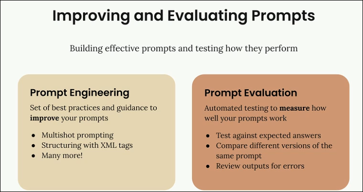
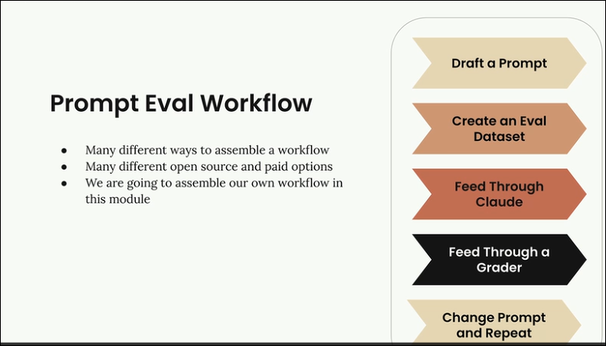
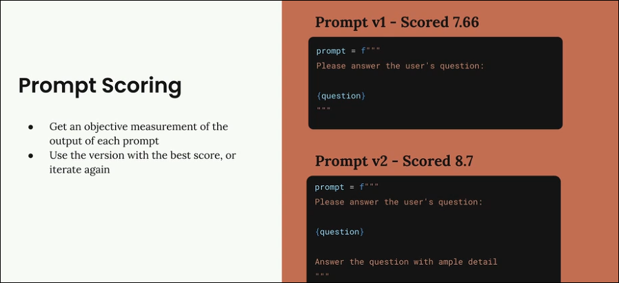

# Prompt Engineering & Evaluation Notes

## Prompt Development Approaches

### Three Testing Strategies

## Core Concepts

## Evaluation Workflow

### 4-Step Process

### Example Dataset

- Questions: "What's 2+2?", "How do I make oatmeal?", "How far is the Moon?"
- Graded responses from model outputs
- Average scores determine best prompt version

## Scoring & Iteration

### Objective Measurement

- Each prompt version gets numeric score
- Compare scores: **v1 = 7.66**, **v2 = 8.7**
- Higher score = better prompt
- Select best version or continue iterating

### Iteration Example

**v1 Prompt**: Basic question answering  
**v2 Improvement**: Added "Answer with ample detail"  
**Result**: Score increased from 7.66 to 8.7

## Key Takeaways

- Always test prompts before production use
- Use structured evaluation for reliability
- Score prompts numerically for objective comparison
- Iterate based on evaluation results
- Build custom workflows using available tools
